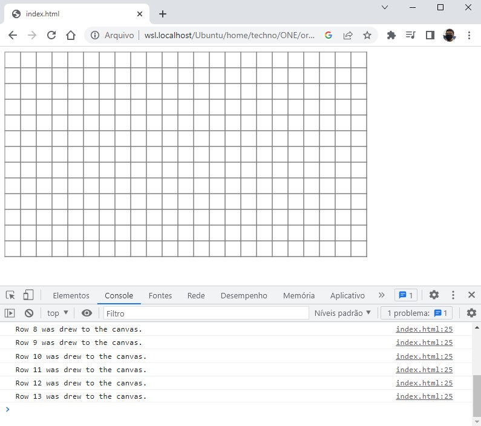

# 🎯 Atividade 02-05

> Essa atividade pertence ao curso **JavaScript e HTML: pratique lógica com desenhos, animações e um jogo** da formação **Iniciante em Programação**.

## Objetivo

Desenhar uma grade em um canvas utilizando loops e funcões para evitar repetição de código.

## Screenshot

## Arquivos

    📁 Atividade
    |   index.html → Arquivo HTML principal
