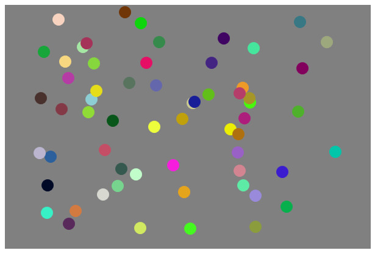

# 🎯 Atividade 03-02

> Essa atividade pertence ao curso **JavaScript e HTML: pratique lógica com desenhos, animações e um jogo** da formação **Iniciante em Programação**.

## Objetivo

Desenhar círculos no canvas conforme o usuário clica na tela.

## Screenshot

## Arquivos

    📁 Atividade
    |   index.html → Arquivo HTML principal
