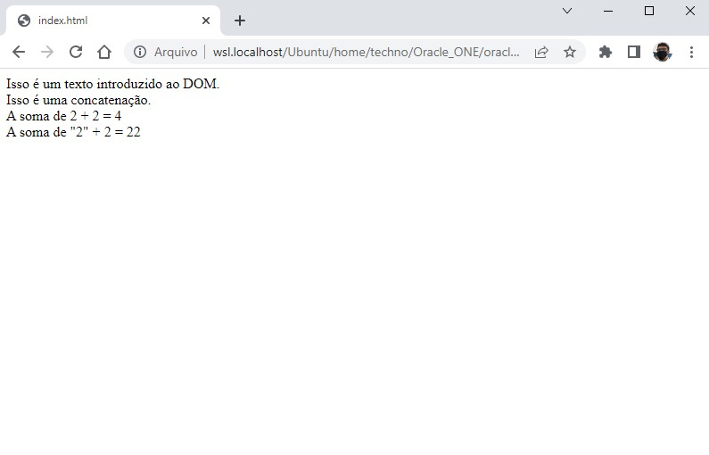

# 🎯 Atividade 02-04

## Objetivo

Introduzir a manipulação simples do DOM através do `document.write`, além de apresentar operações matemáticas e concatenação.

## Screenshot

## Arquivos

    📁 Atividade
    |   index.html → Arquivo HTML principal
