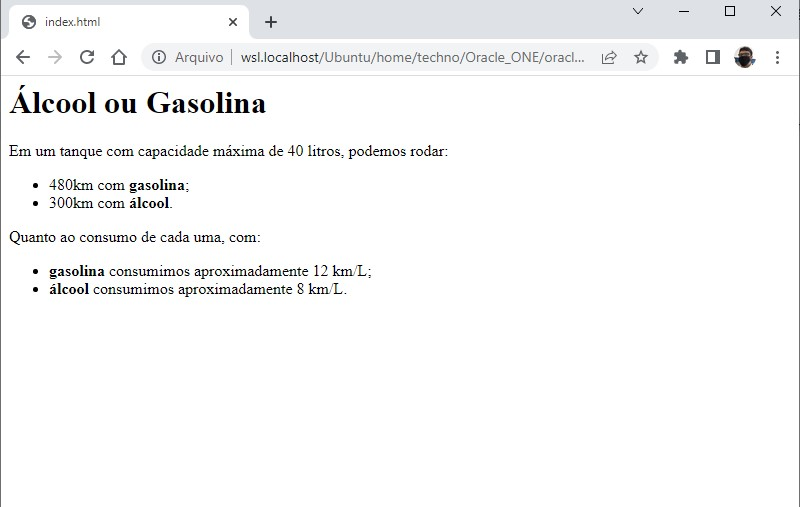

# 🎯 Atividade 02-12

> Essa atividade pertence ao curso **JavaScript e HTML: desenvolva um jogo e pratique lógica de programação** da formação **Iniciante em Programação**.

## Objetivo

Utilizar os conhecimentos adquiridos sobre variáveis, concatenação e operações
matemáticas para calcular e apresentar o consumo de gasolina e álcool.

## 😥 Dificuldades

1. Cálculo do consumo de gasolina e álcool.
    - **Solução:** Recorrer ao código de ajuda da atividade para saber a fórmula.

## Screenshot

## Arquivos

    📁 Atividade
    |   index.html → Arquivo HTML principal
