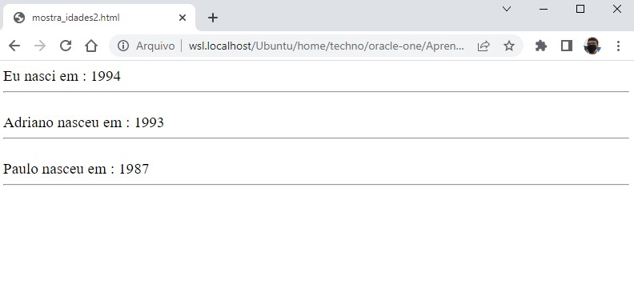

# 🎯 Atividade 03-14

> Essa atividade pertence ao curso **JavaScript e HTML: desenvolva um jogo e pratique lógica de programação** da formação **Iniciante em Programação**.

## Objetivo

Praticar a declaração de funções e sua utilização para evitar a repetição de código (base do DRY).

## Etapas

1. Altere sua função pulaLinha para que ela pule duas linhas! Isto é, faça dois \ s.
2. Há uma tag HTML que também é interessante para separar um resultado do outro, a \
. Altere a função pulaLinha() para que ela escreva no navegador um \
 entre os dois \ s que você já fez.
3. A fonte do nosso programa talvez ainda não seja adequada. Há uma tag HTML que se chama \<big>. Faça com que a função mostra coloque a frase entre \<big> e \</big>.
4. O que acontece se você esquecer a palavra function na hora de declarar uma de suas funções? E os parênteses na declaração da função pulaLinha? Faça o teste e veja as mensagens de erro no console JavaScript do Chrome.

## Resultado

## Arquivos

    📁 Atividade
    |   index.html → Arquivo HTML principal
