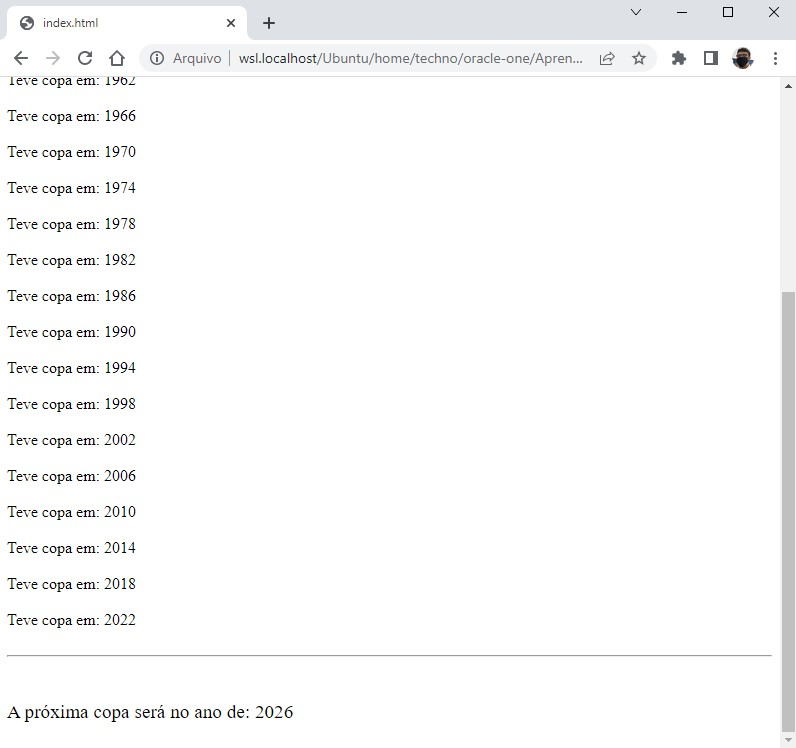

# 🎯 Atividade 07-01

> Essa atividade pertence ao curso **JavaScript e HTML: desenvolva um jogo e pratique lógica de programação** da formação **Iniciante em Programação**.

## Objetivo

Mostrar o ano de todas as copas desde 1930 até o ano atual utilizando a estrutura de repetição `while`.

## Screenshot

## Arquivos

    📁 Atividade
    |   index.html → Arquivo HTML principal
