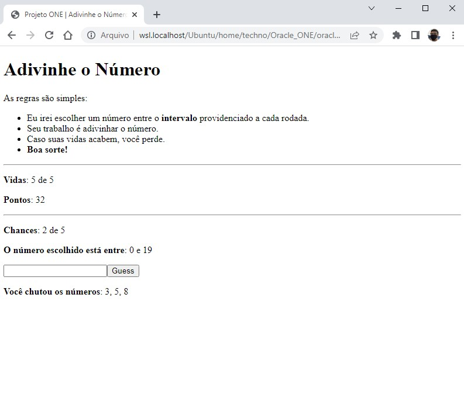

# 🎯 Atividade 09-14 (Projeto Final)

> Essa atividade pertence ao curso **JavaScript e HTML: desenvolva um jogo e pratique lógica de programação** da formação **Iniciante em Programação**.

## Objetivo

Utilizar todas as técnicas aprendidas até o momento para desenvolver um jogo de adivinhação com interface HTML.

## Testar

Você pode testar esse jogo clicando [aqui](https://oracle-one.vercel.app/curso-JavaScript_L%C3%B3gica_Programa%C3%A7%C3%A3o/09-14/index.html)!

## Screenshot

## Arquivos

    📁 Atividade
    |   index.html → Arquivo HTML principal
    |   main.js → Arquivo JS principal
