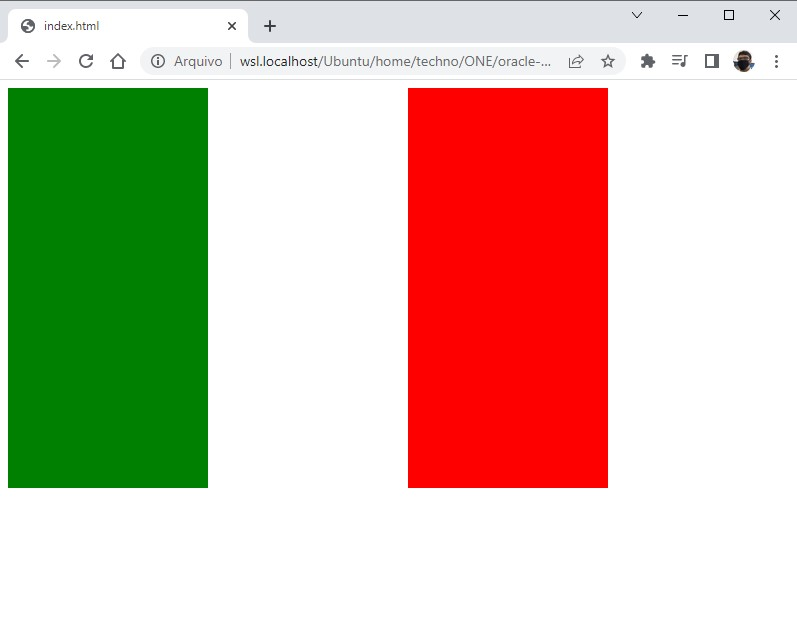

# 🎯 Atividade 01-03

> Essa atividade pertence ao curso **JavaScript e HTML: pratique lógica com desenhos, animações e um jogo** da formação **Iniciante em Programação**.

## Objetivo

Desenhar a bandeira da Itália dentro de um canvas.

## Screenshot

## Arquivos

    📁 Atividade
    |   index.html → Arquivo HTML principal
