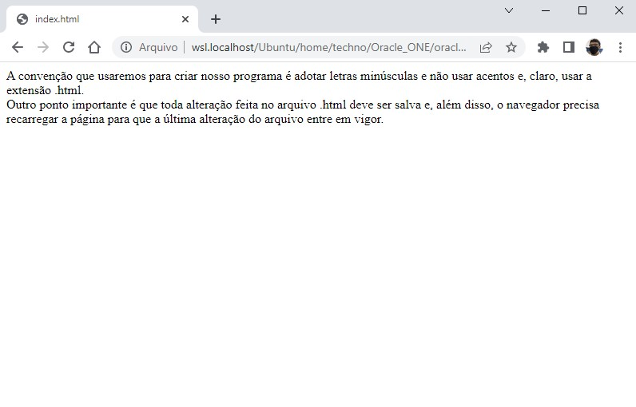

# 🎯 Atividade 01-14

> Essa atividade pertence ao curso **JavaScript e HTML: desenvolva um jogo e pratique lógica de programação** da formação **Iniciante em Programação**.

## Objetivo

Introduzir à sintaxe básica HTML explorando as tags `<meta>` e ` ` com o objetivo de melhorar o estilo visual da página.

## Screenshot

## Arquivos

    📁 Atividade
    |   index.html → Arquivo HTML principal
