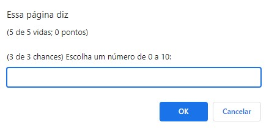

# 🎯 Atividade 06-09

> Essa atividade pertence ao curso **JavaScript e HTML: desenvolva um jogo e pratique lógica de programação** da formação **Iniciante em Programação**.

## Objetivo

Criar um jogo de adivinhação de número utilizando `prompts` e `alerts`.

## Screenshots

### `Alert` de Introdução

---

### `Prompt` de Adivinhação

## Arquivos

    📁 Atividade
    |   index.html → Arquivo HTML principal
